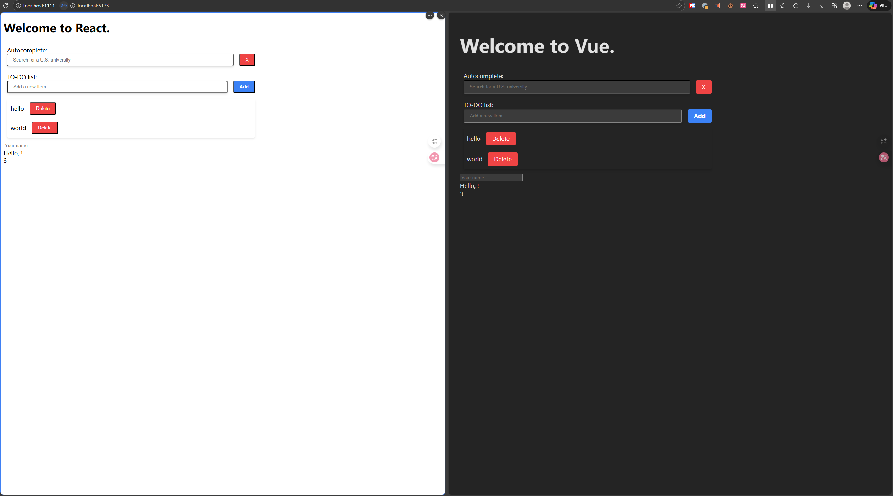

# Mitosis 使用方法

[BuilderIO / mitosis](https://github.com/BuilderIO/mitosis)

[Quickstart](https://mitosis.builder.io/docs/quickstart/)。滚动到最底部，有一个直观的演示动图


结果：



## 开发流程

**1. 启动 Mitosis 开发模式（监听并编译）**
```bash
cd library
npm run start
```

**2. 运行测试应用（预览效果）**
```bash
# 根据你想测试的框架选择
cd test-apps/react && npm run dev
cd test-apps/vue && npm run dev
cd test-apps/qwik && npm run dev # 未测试过，不一定能启动
cd test-apps/svelte && npm run dev # 未测试过，不一定能启动
```

## 工作流程

- 在 `library/src/` 目录下编写 `.lite.tsx` 组件
- Mitosis 会自动编译到 `library/packages/{框架}/` 目录
- 测试应用直接导入编译后的组件使用

## 配置

修改根目录下的 `mitosis.config.cjs` 可添加更多输出目标。

[官方文档 - Configuration](https://mitosis.builder.io/docs/configuration/)
